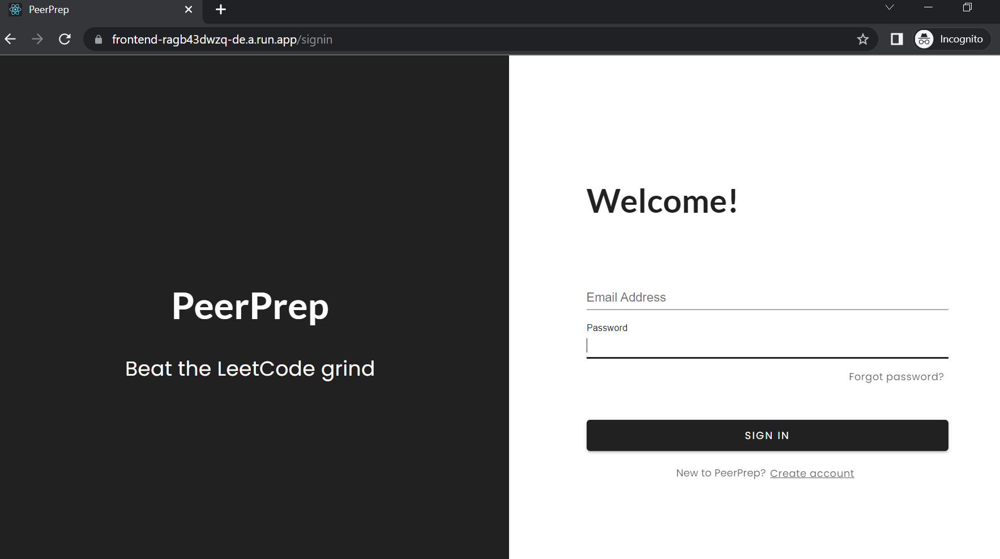

# Group 34 PeerPrep Project

## Running the application at the Deployed Endpoint
Follow the following steps to access the application via the deployed endpoint:
1. Access the deloyed endpoint at: https://frontend-ragb43dwzq-de.a.run.app/

## Running the application locally via Docker
Use this to start up all the services to run the application locally via Docker:
1. Run `docker compose up` in the project directory 
2. Access the front end at: http://localhost:3000/ 

## Running the application locally via the raw files (without Docker)
The subsequent sections are for running the individual services locally i.e not in a docker container.
### User Service
1. In the user-service directory, rename `sample-env.txt` file to `.env`.
2. Create a Cloud DB URL using Mongo Atlas.
3. Enter the DB URL created as `DB_CLOUD_URI` in `.env` file.
4. The remaining fields are for the following
    1. JWT_SECRET : Any string as long as its consistent throughout the four services.
    2. FRONTEND_URL : URL of Frontend
    3. FROM_NAME : The name that will be shown on the email if
    user forgot their password
    4. FROM_EMAIL : The email address that will be used to
    send users email if they forgot their password
    5. FROM_EMAIL_PW : The password of the email address above to log in
    6. TO_EMAIL : Used as the actual address to send as
    most of the emails provided are fake.
5. Install npm packages using `npm i`.
6. Run User Service using `npm start`.

### Matching Service
1. In the matching-service directory, rename `sample-env.txt` file to `.env`.
2. The fields are similar to above.
3. Install npm packages using `npm i`.
4. Run Matching Service using `node index.js`.
### Collab Service
1. In the collab-service directory, rename `sample-env.txt` file to `.env`.
2. The fields are similar to above.
3. Install npm packages using `npm i`.
4. Run Collab Service using `node index.js`.
### Question Service 
1. In the question-service directory, rename `sample-env.txt` file to `.env`.
2. The fields are similar to above.
3. Install npm packages using `npm i`.
4. Run Collab Service using `node index.js`.
### Frontend
1. In the frontend directory, Install npm packages using `npm i`.
2. Run Frontend using `npm start`.
3. Access the frontend at: http://localhost:3000/ 
